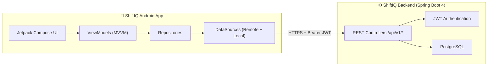
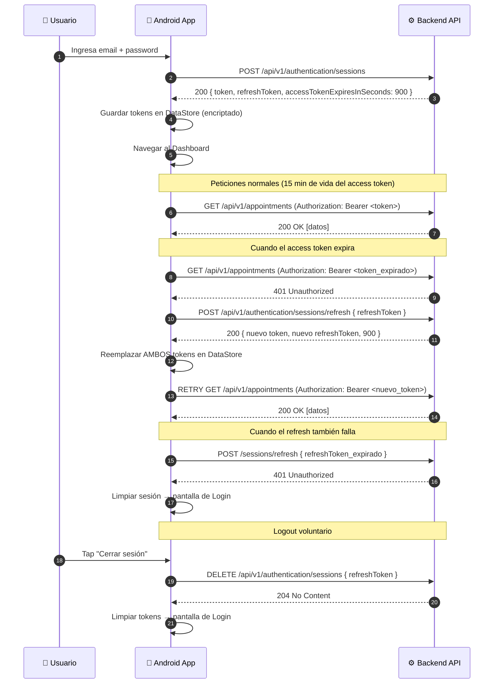
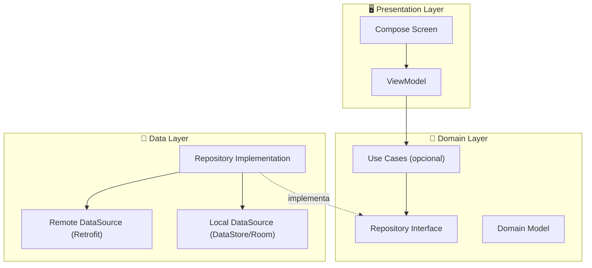

# 📱 Guía de Desarrollo — ShiftIQ Mobile App (Android Studio + Kotlin)

Guía paso a paso para construir la aplicación móvil Android nativa de **ShiftIQ Platform** consumiendo el backend Spring Boot 4 existente.

---

## 📌 Tabla de Contenidos

1. [Visión General de la Arquitectura Móvil](#1-visión-general-de-la-arquitectura-móvil)
2. [Stack Tecnológico Recomendado](#2-stack-tecnológico-recomendado)
3. [Fase 1 — Configuración del Proyecto](#3-fase-1--configuración-del-proyecto)
4. [Fase 2 — Capa de Red (Networking)](#4-fase-2--capa-de-red-networking)
5. [Fase 3 — Autenticación y Gestión de Sesión](#5-fase-3--autenticación-y-gestión-de-sesión)
6. [Fase 4 — Arquitectura de la App (MVVM + Clean Architecture)](#6-fase-4--arquitectura-de-la-app-mvvm--clean-architecture)
7. [Fase 5 — Módulos por Bounded Context](#7-fase-5--módulos-por-bounded-context)
8. [Fase 6 — Manejo Global de Errores](#8-fase-6--manejo-global-de-errores)
9. [Fase 7 — Navegación](#9-fase-7--navegación)
10. [Fase 8 — Testing](#10-fase-8--testing)
11. [Fase 9 — Build, Firma y Despliegue](#11-fase-9--build-firma-y-despliegue)
12. [Catálogo Completo de Endpoints a Consumir](#12-catálogo-completo-de-endpoints-a-consumir)
13. [Roadmap de Desarrollo Sugerido](#13-roadmap-de-desarrollo-sugerido)

---

## 1. Visión General de la Arquitectura Móvil

La app Android actúa como un **cliente REST** del backend `ShiftIQ Platform`. Toda la lógica de negocio, validaciones y persistencia viven en el servidor. La app se comunica exclusivamente a través de la API REST versionada (`/api/v1/...`) usando JSON sobre HTTPS con tokens JWT.



> [!IMPORTANT]
> La app **nunca** accede directamente a la base de datos. Todo pasa por la API REST.

---

## 2. Stack Tecnológico Recomendado

| Categoría | Tecnología | Justificación |
|:---|:---|:---|
| **Lenguaje** | Kotlin 2.x | Lenguaje oficial de Android, null-safety, coroutines nativas |
| **UI** | Jetpack Compose + Material 3 | UI declarativa moderna, recomendada por Google |
| **Arquitectura** | MVVM + Clean Architecture | Separación de capas análoga al backend DDD |
| **Networking** | Retrofit 2 + OkHttp 4 | Cliente HTTP type-safe para APIs REST |
| **Serialización JSON** | Kotlinx Serialization / Moshi | Parsing eficiente de respuestas JSON |
| **Inyección de Dependencias** | Hilt (Dagger) | DI recomendada por Google para Android |
| **Navegación** | Jetpack Navigation Compose | Navegación declarativa entre pantallas |
| **Almacenamiento Local** | DataStore (Preferences) | Para tokens JWT y preferencias del usuario |
| **Base de Datos Local (Cache)** | Room | Cache offline de datos frecuentes (opcional) |
| **Imágenes** | Coil | Carga eficiente de imágenes en Compose |
| **Testing** | JUnit 5, MockK, Turbine | Tests unitarios y de flujos |
| **Min SDK** | API 26 (Android 8.0) | ~95% de dispositivos activos |

---

## 3. Fase 1 — Configuración del Proyecto

### 3.1. Crear el proyecto en Android Studio

1. **File → New → New Project → Empty Activity** (Compose)
2. Configurar:
   - **Name:** `ShiftIQ`
   - **Package:** `com.tuxlogic.shiftiq`
   - **Language:** Kotlin
   - **Min SDK:** API 26
   - **Build System:** Gradle (Kotlin DSL)

### 3.2. Estructura de paquetes (Clean Architecture)

Organiza los paquetes siguiendo **la misma filosofía DDD del backend**, separando por feature/bounded context:

```
com.tuxlogic.shiftiq/
├── core/                          # App-level: Application, DI modules, theme
│   ├── di/                        # Módulos Hilt globales
│   ├── navigation/                # NavGraph, rutas
│   ├── theme/                     # Material 3 Theme, Colors, Typography
│   └── util/                      # Extensiones y utilidades compartidas
│
├── data/                          # Capa de datos global
│   ├── remote/                    # Configuración Retrofit, Interceptors
│   │   ├── api/                   # Interfaces Retrofit por bounded context
│   │   ├── dto/                   # Data Transfer Objects (request/response)
│   │   └── interceptor/          # AuthInterceptor, TokenAuthenticator
│   ├── local/                     # DataStore, Room DAOs
│   └── repository/               # Implementaciones de Repository
│
├── domain/                        # Capa de dominio (modelos puros Kotlin)
│   ├── model/                     # Entidades de dominio de la app
│   └── repository/               # Interfaces de Repository (contratos)
│
├── feature/                       # Features/pantallas por bounded context
│   ├── auth/                      # Login, Signup, Forgot Password
│   ├── dashboard/                 # Pantalla principal / KPIs
│   ├── fleet/                     # Citas (Appointments)
│   ├── core_management/           # Talleres, sucursales, empleados, clientes
│   ├── inventory/                 # Productos y stock
│   ├── operations/                # Órdenes de trabajo
│   ├── iot/                       # Vehículos y telemetría
│   ├── billing/                   # Cotizaciones y pagos
│   └── profile/                   # Perfil del usuario
```

### 3.3. Dependencias clave (`build.gradle.kts` del módulo app)

```kotlin
dependencies {
    // Compose BOM
    val composeBom = platform("androidx.compose:compose-bom:2025.05.00")
    implementation(composeBom)
    implementation("androidx.compose.material3:material3")
    implementation("androidx.compose.ui:ui-tooling-preview")
    implementation("androidx.activity:activity-compose:1.9.0")
    implementation("androidx.lifecycle:lifecycle-viewmodel-compose:2.8.0")
    implementation("androidx.navigation:navigation-compose:2.8.0")

    // Networking
    implementation("com.squareup.retrofit2:retrofit:2.11.0")
    implementation("com.squareup.retrofit2:converter-moshi:2.11.0")
    implementation("com.squareup.okhttp3:okhttp:4.12.0")
    implementation("com.squareup.okhttp3:logging-interceptor:4.12.0")
    implementation("com.squareup.moshi:moshi-kotlin:1.15.1")
    kapt("com.squareup.moshi:moshi-kotlin-codegen:1.15.1")

    // DI - Hilt
    implementation("com.google.dagger:hilt-android:2.51")
    kapt("com.google.dagger:hilt-compiler:2.51")
    implementation("androidx.hilt:hilt-navigation-compose:1.2.0")

    // DataStore
    implementation("androidx.datastore:datastore-preferences:1.1.0")

    // Coroutines
    implementation("org.jetbrains.kotlinx:kotlinx-coroutines-android:1.8.0")

    // Images
    implementation("io.coil-kt:coil-compose:2.6.0")

    // Testing
    testImplementation("junit:junit:4.13.2")
    testImplementation("io.mockk:mockk:1.13.10")
    testImplementation("app.cash.turbine:turbine:1.1.0")
    testImplementation("org.jetbrains.kotlinx:kotlinx-coroutines-test:1.8.0")
}
```

### 3.4. Permisos (`AndroidManifest.xml`)

```xml
<uses-permission android:name="android.permission.INTERNET" />
<uses-permission android:name="android.permission.ACCESS_NETWORK_STATE" />
```

---

## 4. Fase 2 — Capa de Red (Networking)

### 4.1. Configuración base de la URL

Crea un archivo `BuildConfig` o usa `local.properties` para manejar la URL base:

```kotlin
// core/util/Constants.kt
object Constants {
    // Desarrollo local: usar la IP de tu PC en la red local (no "localhost")
    // ya que el emulador usa 10.0.2.2 para acceder al host
    const val BASE_URL_EMULATOR = "http://10.0.2.2:8080/"
    const val BASE_URL_DEVICE = "http://192.168.X.X:8080/"  // tu IP local
    const val BASE_URL_PRODUCTION = "https://api.shiftiq.com/"
}
```

### 4.2. Modelos DTO (Data Transfer Objects)

Mapea exactamente las estructuras JSON del backend. Ejemplo basado en los records Java del servidor:

```kotlin
// data/remote/dto/auth/SignInRequest.kt
@JsonClass(generateAdapter = true)
data class SignInRequest(
    val email: String,
    val password: String
)

// data/remote/dto/auth/AuthenticatedUserResponse.kt
@JsonClass(generateAdapter = true)
data class AuthenticatedUserResponse(
    val id: String,          // UUID como String
    val email: String,
    val role: String,
    val token: String,       // Access token (Bearer)
    val refreshToken: String,
    val accessTokenExpiresInSeconds: Long  // 900 = 15 min
)

// data/remote/dto/auth/RefreshSessionRequest.kt
@JsonClass(generateAdapter = true)
data class RefreshSessionRequest(
    val refreshToken: String
)

// data/remote/dto/auth/RevokeSessionRequest.kt
@JsonClass(generateAdapter = true)
data class RevokeSessionRequest(
    val refreshToken: String
)

// data/remote/dto/common/ErrorResponse.kt
@JsonClass(generateAdapter = true)
data class ErrorResponse(
    val code: String,
    val message: String,
    val details: String? = null
)
```

### 4.3. Interfaces Retrofit por Bounded Context

```kotlin
// data/remote/api/AuthApi.kt
interface AuthApi {

    @POST("api/v1/authentication/sessions")
    suspend fun signIn(@Body request: SignInRequest): Response<AuthenticatedUserResponse>

    @POST("api/v1/authentication/sessions/google")
    suspend fun googleSignIn(@Body request: GoogleSignInRequest): Response<AuthenticatedUserResponse>

    @POST("api/v1/authentication/sessions/refresh")
    suspend fun refreshSession(@Body request: RefreshSessionRequest): Response<AuthenticatedUserResponse>

    @HTTP(method = "DELETE", path = "api/v1/authentication/sessions", hasBody = true)
    suspend fun revokeSession(@Body request: RevokeSessionRequest): Response<Void>

    @POST("api/v1/authentication/password-recoveries")
    suspend fun forgotPassword(@Body request: PasswordRecoveryRequest): Response<Void>

    @POST("api/v1/authentication/password-resets")
    suspend fun resetPassword(@Body request: ResetPasswordRequest): Response<Void>
}
```

```kotlin
// data/remote/api/FleetApi.kt
interface FleetApi {

    @POST("api/v1/appointments")
    suspend fun createAppointment(@Body request: CreateAppointmentRequest): Response<AppointmentResponse>

    @GET("api/v1/appointments")
    suspend fun getAppointments(
        @Query("branchId") branchId: String,
        @Query("status") status: String? = null
    ): Response<List<AppointmentResponse>>

    @PATCH("api/v1/appointments/{id}/status")
    suspend fun updateAppointmentStatus(
        @Path("id") id: String,
        @Body request: UpdateAppointmentStatusRequest
    ): Response<AppointmentResponse>
}
```

> [!TIP]
> Crea una interfaz Retrofit **por cada bounded context** del backend: `AuthApi`, `CoreApi`, `FleetApi`, `InventoryApi`, `OperationsApi`, `IoTApi`, `BillingApi`, `AnalyticsApi`.

### 4.4. Módulo Hilt de Networking

```kotlin
// core/di/NetworkModule.kt
@Module
@InstallIn(SingletonComponent::class)
object NetworkModule {

    @Provides
    @Singleton
    fun provideOkHttpClient(
        authInterceptor: AuthInterceptor,
        tokenAuthenticator: TokenAuthenticator
    ): OkHttpClient {
        return OkHttpClient.Builder()
            .addInterceptor(authInterceptor)
            .authenticator(tokenAuthenticator)
            .addInterceptor(HttpLoggingInterceptor().apply {
                level = if (BuildConfig.DEBUG)
                    HttpLoggingInterceptor.Level.BODY
                else
                    HttpLoggingInterceptor.Level.NONE
            })
            .connectTimeout(30, TimeUnit.SECONDS)
            .readTimeout(30, TimeUnit.SECONDS)
            .build()
    }

    @Provides
    @Singleton
    fun provideRetrofit(okHttpClient: OkHttpClient): Retrofit {
        return Retrofit.Builder()
            .baseUrl(Constants.BASE_URL_EMULATOR)
            .client(okHttpClient)
            .addConverterFactory(MoshiConverterFactory.create(
                Moshi.Builder()
                    .add(KotlinJsonAdapterFactory())
                    .build()
            ))
            .build()
    }

    @Provides @Singleton
    fun provideAuthApi(retrofit: Retrofit): AuthApi = retrofit.create(AuthApi::class.java)

    @Provides @Singleton
    fun provideCoreApi(retrofit: Retrofit): CoreApi = retrofit.create(CoreApi::class.java)

    @Provides @Singleton
    fun provideFleetApi(retrofit: Retrofit): FleetApi = retrofit.create(FleetApi::class.java)

    // ... un @Provides por cada API interface
}
```

---

## 5. Fase 3 — Autenticación y Gestión de Sesión

Este es el módulo **más crítico** y debe implementarse primero. El backend usa **JWT con refresh token rotation**, lo que requiere un manejo cuidadoso en la app.

### 5.1. Flujo de autenticación completo



### 5.2. TokenManager (DataStore)

```kotlin
// data/local/TokenManager.kt
@Singleton
class TokenManager @Inject constructor(
    @ApplicationContext private val context: Context
) {
    private val dataStore = context.dataStore

    companion object {
        private val ACCESS_TOKEN_KEY = stringPreferencesKey("access_token")
        private val REFRESH_TOKEN_KEY = stringPreferencesKey("refresh_token")
        private val USER_ID_KEY = stringPreferencesKey("user_id")
        private val USER_ROLE_KEY = stringPreferencesKey("user_role")
        private val TOKEN_EXPIRY_KEY = longPreferencesKey("token_expiry_millis")
    }

    val accessToken: Flow<String?> = dataStore.data.map { it[ACCESS_TOKEN_KEY] }
    val refreshToken: Flow<String?> = dataStore.data.map { it[REFRESH_TOKEN_KEY] }
    val userId: Flow<String?> = dataStore.data.map { it[USER_ID_KEY] }

    suspend fun saveSession(response: AuthenticatedUserResponse) {
        dataStore.edit { prefs ->
            prefs[ACCESS_TOKEN_KEY] = response.token
            prefs[REFRESH_TOKEN_KEY] = response.refreshToken
            prefs[USER_ID_KEY] = response.id
            prefs[USER_ROLE_KEY] = response.role
            prefs[TOKEN_EXPIRY_KEY] = System.currentTimeMillis() +
                (response.accessTokenExpiresInSeconds * 1000)
        }
    }

    suspend fun clearSession() {
        dataStore.edit { it.clear() }
    }

    suspend fun getAccessTokenSync(): String? =
        dataStore.data.map { it[ACCESS_TOKEN_KEY] }.first()

    suspend fun getRefreshTokenSync(): String? =
        dataStore.data.map { it[REFRESH_TOKEN_KEY] }.first()
}
```

### 5.3. AuthInterceptor (inyectar Bearer token)

```kotlin
// data/remote/interceptor/AuthInterceptor.kt
@Singleton
class AuthInterceptor @Inject constructor(
    private val tokenManager: TokenManager
) : Interceptor {

    override fun intercept(chain: Interceptor.Chain): okhttp3.Response {
        val token = runBlocking { tokenManager.getAccessTokenSync() }
        val request = chain.request().newBuilder().apply {
            if (!token.isNullOrBlank()) {
                addHeader("Authorization", "Bearer $token")
            }
            addHeader("Accept", "application/json")
            addHeader("Content-Type", "application/json")
        }.build()
        return chain.proceed(request)
    }
}
```

### 5.4. TokenAuthenticator (refresh automático ante 401)

```kotlin
// data/remote/interceptor/TokenAuthenticator.kt
@Singleton
class TokenAuthenticator @Inject constructor(
    private val tokenManager: TokenManager,
    @ApplicationContext private val context: Context
) : Authenticator {

    private val lock = Mutex()

    override fun authenticate(route: Route?, response: okhttp3.Response): Request? {
        // Si ya se intentó refresh y falló, no re-intentar (evitar loop)
        if (response.request.header("X-Retry") != null) return null

        return runBlocking {
            lock.withLock {
                val refreshToken = tokenManager.getRefreshTokenSync() ?: run {
                    tokenManager.clearSession()
                    return@runBlocking null
                }

                // Crear un OkHttp client limpio (sin interceptors de auth)
                val client = OkHttpClient.Builder().build()
                val moshi = Moshi.Builder().add(KotlinJsonAdapterFactory()).build()

                val refreshBody = RefreshSessionRequest(refreshToken)
                val jsonBody = moshi.adapter(RefreshSessionRequest::class.java)
                    .toJson(refreshBody)
                    .toRequestBody("application/json".toMediaType())

                val refreshRequest = Request.Builder()
                    .url("${Constants.BASE_URL_EMULATOR}api/v1/authentication/sessions/refresh")
                    .post(jsonBody)
                    .build()

                val refreshResponse = client.newCall(refreshRequest).execute()

                if (refreshResponse.isSuccessful) {
                    val body = refreshResponse.body?.string()
                    val newSession = moshi.adapter(AuthenticatedUserResponse::class.java)
                        .fromJson(body!!)!!
                    tokenManager.saveSession(newSession)

                    // Reintentar la petición original con el nuevo token
                    response.request.newBuilder()
                        .header("Authorization", "Bearer ${newSession.token}")
                        .header("X-Retry", "true")
                        .build()
                } else {
                    // Refresh falló → sesión terminada
                    tokenManager.clearSession()
                    null
                }
            }
        }
    }
}
```

> [!CAUTION]
> El backend usa **refresh token rotation** (single-use). Cada refresh token solo se puede usar **una vez**. Si la app hace dos refresh simultáneos, el segundo fallará. El `Mutex()` en `TokenAuthenticator` previene esto.

---

## 6. Fase 4 — Arquitectura de la App (MVVM + Clean Architecture)

La app replica la filosofía de capas del backend (Hexagonal/DDD) adaptada al ecosistema Android:



### Ejemplo completo: Feature `Appointments` (Fleet Context)

**1. Domain Model:**
```kotlin
// domain/model/Appointment.kt
data class Appointment(
    val id: String,
    val branchId: String,
    val customerId: String,
    val vehicleId: String,
    val scheduledDate: String,
    val status: AppointmentStatus,
    val summary: String?
)

enum class AppointmentStatus {
    REQUESTED, CONFIRMED, IN_PROGRESS, COMPLETED, CANCELLED
}
```

**2. Repository Interface:**
```kotlin
// domain/repository/AppointmentRepository.kt
interface AppointmentRepository {
    suspend fun getAppointments(branchId: String, status: String? = null): Result<List<Appointment>>
    suspend fun createAppointment(request: CreateAppointmentRequest): Result<Appointment>
    suspend fun updateStatus(id: String, newStatus: String): Result<Appointment>
}
```

**3. Repository Implementation:**
```kotlin
// data/repository/AppointmentRepositoryImpl.kt
@Singleton
class AppointmentRepositoryImpl @Inject constructor(
    private val fleetApi: FleetApi
) : AppointmentRepository {

    override suspend fun getAppointments(branchId: String, status: String?): Result<List<Appointment>> {
        return safeApiCall { fleetApi.getAppointments(branchId, status) }
            .map { list -> list.map { it.toDomain() } }
    }

    override suspend fun createAppointment(request: CreateAppointmentRequest): Result<Appointment> {
        return safeApiCall { fleetApi.createAppointment(request) }
            .map { it.toDomain() }
    }
    // ...
}
```

**4. ViewModel:**
```kotlin
// feature/fleet/AppointmentsViewModel.kt
@HiltViewModel
class AppointmentsViewModel @Inject constructor(
    private val repository: AppointmentRepository
) : ViewModel() {

    private val _uiState = MutableStateFlow<AppointmentsUiState>(AppointmentsUiState.Loading)
    val uiState: StateFlow<AppointmentsUiState> = _uiState.asStateFlow()

    fun loadAppointments(branchId: String) {
        viewModelScope.launch {
            _uiState.value = AppointmentsUiState.Loading
            repository.getAppointments(branchId)
                .onSuccess { appointments ->
                    _uiState.value = AppointmentsUiState.Success(appointments)
                }
                .onFailure { error ->
                    _uiState.value = AppointmentsUiState.Error(error.message ?: "Error desconocido")
                }
        }
    }
}

sealed class AppointmentsUiState {
    data object Loading : AppointmentsUiState()
    data class Success(val appointments: List<Appointment>) : AppointmentsUiState()
    data class Error(val message: String) : AppointmentsUiState()
}
```

**5. Compose Screen:**
```kotlin
// feature/fleet/AppointmentsScreen.kt
@Composable
fun AppointmentsScreen(
    viewModel: AppointmentsViewModel = hiltViewModel(),
    branchId: String
) {
    val uiState by viewModel.uiState.collectAsStateWithLifecycle()

    LaunchedEffect(branchId) {
        viewModel.loadAppointments(branchId)
    }

    when (val state = uiState) {
        is AppointmentsUiState.Loading -> CircularProgressIndicator()
        is AppointmentsUiState.Success -> {
            LazyColumn {
                items(state.appointments) { appointment ->
                    AppointmentCard(appointment)
                }
            }
        }
        is AppointmentsUiState.Error -> {
            ErrorMessage(state.message)
        }
    }
}
```

---

## 7. Fase 5 — Módulos por Bounded Context

Mapea cada Bounded Context del backend a un **feature module** de la app:

| Backend Bounded Context | Feature Android | Pantallas Principales |
|:---|:---|:---|
| **🔐 IAM** | `feature/auth` | Login, Sign Up, Forgot Password, Reset Password |
| **🏢 Core** | `feature/core_management` | Talleres, Sucursales, Empleados, Clientes, Perfil de roles |
| **🚗 Fleet** | `feature/fleet` | Lista de Citas, Crear Cita, Detalle, Cambiar Estado |
| **📦 Inventory** | `feature/inventory` | Productos, Detalle, Lotes de Stock |
| **🛠️ Operations** | `feature/operations` | Órdenes de Trabajo, Tareas, Servicios, Asignar Repuestos |
| **📡 IoT** | `feature/iot` | Vehículos, Dispositivos OBD-II, Telemetría, Alertas DTC |
| **💳 Billing** | `feature/billing` | Cotizaciones, Comprobantes, Checkout de Pago |
| **📊 Analytics** | `feature/dashboard` | KPIs por sucursal, Resumen de red |

### APIs Retrofit necesarias (una por contexto):

```kotlin
interface CoreApi {
    @POST("api/v1/owners")
    suspend fun createOwner(@Body request: CreateOwnerRequest): Response<OwnerResponse>

    @GET("api/v1/owners/{ownerId}")
    suspend fun getOwner(@Path("ownerId") ownerId: String): Response<OwnerResponse>

    @POST("api/v1/workshops")
    suspend fun createWorkshop(@Body request: CreateWorkshopRequest): Response<WorkshopResponse>

    @GET("api/v1/workshops/{workshopId}")
    suspend fun getWorkshop(@Path("workshopId") workshopId: String): Response<WorkshopResponse>

    @POST("api/v1/branches")
    suspend fun createBranch(@Body request: CreateBranchRequest): Response<BranchResponse>

    @GET("api/v1/branches")
    suspend fun getBranches(@Query("workshopId") workshopId: String? = null): Response<List<BranchResponse>>

    @POST("api/v1/employees")
    suspend fun createEmployee(@Body request: CreateEmployeeRequest): Response<EmployeeResponse>

    @GET("api/v1/employees")
    suspend fun getEmployees(@Query("branchId") branchId: String): Response<List<EmployeeResponse>>

    @POST("api/v1/customers")
    suspend fun createCustomer(@Body request: CreateCustomerRequest): Response<CustomerResponse>

    @GET("api/v1/customers/{customerId}")
    suspend fun getCustomer(@Path("customerId") customerId: String): Response<CustomerResponse>

    @GET("api/v1/profiles/roles")
    suspend fun getUserProfileRoles(@Query("userId") userId: String): Response<List<String>>

    @GET("api/v1/profiles")
    suspend fun getProfileByDocument(@Query("documentNumber") documentNumber: String): Response<ProfileSummaryResponse>
}

interface InventoryApi {
    @POST("api/v1/products")
    suspend fun createProduct(@Body request: CreateProductRequest): Response<ProductResponse>

    @GET("api/v1/products")
    suspend fun getProducts(@Query("branchId") branchId: String): Response<List<ProductResponse>>

    @GET("api/v1/products/{productId}")
    suspend fun getProduct(@Path("productId") productId: String): Response<ProductResponse>

    @POST("api/v1/products/{productId}/batches")
    suspend fun addBatch(
        @Path("productId") productId: String,
        @Body request: AddProductBatchRequest
    ): Response<ProductBatchResponse>
}

interface OperationsApi {
    @POST("api/v1/services")
    suspend fun createService(@Body request: CreateServiceRequest): Response<ServiceResponse>

    @GET("api/v1/services")
    suspend fun getServices(@Query("branchId") branchId: String): Response<List<ServiceResponse>>

    @POST("api/v1/work-orders")
    suspend fun createWorkOrder(@Body request: CreateWorkOrderRequest): Response<WorkOrderResponse>

    @GET("api/v1/work-orders")
    suspend fun getWorkOrders(
        @Query("branchId") branchId: String,
        @Query("status") status: String? = null
    ): Response<List<WorkOrderResponse>>

    @POST("api/v1/work-orders/{id}/tasks")
    suspend fun addTask(
        @Path("id") workOrderId: String,
        @Body request: CreateWorkOrderTaskRequest
    ): Response<WorkOrderTaskResponse>

    @POST("api/v1/work-order-tasks/{taskId}/products")
    suspend fun addProductToTask(
        @Path("taskId") taskId: String,
        @Body request: AddProductToTaskRequest
    ): Response<Any>

    @PATCH("api/v1/work-orders/{id}/complete")
    suspend fun completeWorkOrder(@Path("id") workOrderId: String): Response<WorkOrderResponse>
}

interface IoTApi {
    @POST("api/v1/vehicles")
    suspend fun createVehicle(@Body request: CreateVehicleRequest): Response<VehicleResponse>

    @GET("api/v1/vehicles/{vehicleId}")
    suspend fun getVehicle(@Path("vehicleId") vehicleId: String): Response<VehicleResponse>

    @POST("api/v1/customer-vehicles")
    suspend fun linkCustomerVehicle(@Body request: LinkCustomerVehicleRequest): Response<Any>

    @POST("api/v1/obd2-devices")
    suspend fun createObd2Device(@Body request: CreateObd2DeviceRequest): Response<Obd2DeviceResponse>

    @POST("api/v1/obd2-device-registrations")
    suspend fun registerObd2Device(@Body request: RegisterObd2DeviceRequest): Response<Any>

    @POST("api/v1/telemetry-batches")
    suspend fun sendTelemetryBatch(@Body request: TelemetryBatchRequest): Response<Any>
}

interface BillingApi {
    @POST("api/v1/quotes")
    suspend fun createQuote(@Body request: CreateQuoteRequest): Response<QuoteResponse>

    @POST("api/v1/vouchers")
    suspend fun createVoucher(@Body request: CreateVoucherRequest): Response<VoucherResponse>

    @POST("api/v1/checkouts")
    suspend fun createCheckoutSession(@Body request: CreateCheckoutSessionRequest): Response<CheckoutResponse>
}

interface AnalyticsApi {
    @GET("api/v1/analytics/branches/{branchId}")
    suspend fun getBranchAnalytics(
        @Path("branchId") branchId: String,
        @Query("from") from: String,
        @Query("to") to: String
    ): Response<List<BranchAnalyticsResponse>>

    @GET("api/v1/analytics/network/summary")
    suspend fun getNetworkSummary(
        @Query("from") from: String,
        @Query("to") to: String
    ): Response<NetworkAnalyticsSummaryResponse>
}
```

---

## 8. Fase 6 — Manejo Global de Errores

El backend devuelve errores con formato consistente. La app debe parsear este formato:

### 8.1. Formato de error del backend

```json
{
    "code": "VALIDATION_ERROR",
    "message": "Validation failed: request-body",
    "details": "Field email: El correo electrónico es obligatorio"
}
```

Posibles códigos HTTP y sus códigos de error:

| HTTP Status | Código de Error | Significado |
|:---|:---|:---|
| 400 | `VALIDATION_ERROR` | Datos inválidos en la petición |
| 401 | – (sin body) | Token inválido / no autenticado |
| 403 | `ACCESS_DENIED` | Sin permisos (multi-tenancy) |
| 404 | `*_NOT_FOUND` | Recurso inexistente |
| 405 | `METHOD_NOT_ALLOWED` | Método HTTP no soportado |
| 409 | `*_CONFLICT` | Conflicto de datos o concurrencia optimista |
| 422 | `BUSINESS_RULE_VIOLATION` | Violación de regla de negocio |
| 500 | `UNEXPECTED_ERROR` | Error interno del servidor |

### 8.2. Wrapper `safeApiCall`

```kotlin
// core/util/SafeApiCall.kt
suspend fun <T> safeApiCall(apiCall: suspend () -> Response<T>): Result<T> {
    return try {
        val response = apiCall()
        if (response.isSuccessful) {
            val body = response.body()
            if (body != null) {
                Result.success(body)
            } else {
                Result.success(Unit as T) // Para respuestas 204 No Content
            }
        } else {
            val errorBody = response.errorBody()?.string()
            val errorResponse = try {
                Moshi.Builder().add(KotlinJsonAdapterFactory()).build()
                    .adapter(ErrorResponse::class.java)
                    .fromJson(errorBody ?: "")
            } catch (e: Exception) { null }

            val message = errorResponse?.details
                ?: errorResponse?.message
                ?: "Error ${response.code()}"

            Result.failure(ApiException(
                httpCode = response.code(),
                errorCode = errorResponse?.code ?: "UNKNOWN",
                errorMessage = message
            ))
        }
    } catch (e: IOException) {
        Result.failure(ApiException(
            httpCode = 0,
            errorCode = "NETWORK_ERROR",
            errorMessage = "Sin conexión a internet"
        ))
    } catch (e: Exception) {
        Result.failure(ApiException(
            httpCode = 0,
            errorCode = "UNKNOWN",
            errorMessage = e.message ?: "Error desconocido"
        ))
    }
}

class ApiException(
    val httpCode: Int,
    val errorCode: String,
    val errorMessage: String
) : Exception(errorMessage)
```

---

## 9. Fase 7 — Navegación

### 9.1. Definir rutas

```kotlin
// core/navigation/Routes.kt
sealed class Routes(val route: String) {
    // Auth
    data object Login : Routes("login")
    data object SignUp : Routes("signup")
    data object ForgotPassword : Routes("forgot-password")

    // Main
    data object Dashboard : Routes("dashboard")
    data object Profile : Routes("profile")

    // Fleet
    data object Appointments : Routes("appointments/{branchId}") {
        fun createRoute(branchId: String) = "appointments/$branchId"
    }
    data object AppointmentDetail : Routes("appointments/detail/{id}")

    // Operations
    data object WorkOrders : Routes("work-orders/{branchId}")
    data object WorkOrderDetail : Routes("work-orders/detail/{id}")

    // Inventory
    data object Products : Routes("products/{branchId}")
    data object ProductDetail : Routes("products/detail/{id}")

    // ... más rutas por feature
}
```

### 9.2. NavGraph

```kotlin
// core/navigation/ShiftIQNavGraph.kt
@Composable
fun ShiftIQNavGraph(navController: NavHostController) {
    NavHost(navController = navController, startDestination = Routes.Login.route) {

        // Auth flow
        composable(Routes.Login.route) {
            LoginScreen(
                onLoginSuccess = { navController.navigate(Routes.Dashboard.route) { popUpTo(0) } },
                onNavigateToSignUp = { navController.navigate(Routes.SignUp.route) },
                onNavigateToForgotPassword = { navController.navigate(Routes.ForgotPassword.route) }
            )
        }

        composable(Routes.SignUp.route) {
            SignUpScreen(onNavigateBack = { navController.popBackStack() })
        }

        // Main flow (con Bottom Navigation)
        composable(Routes.Dashboard.route) {
            MainScreen(navController = navController)
        }

        // Fleet
        composable(
            Routes.Appointments.route,
            arguments = listOf(navArgument("branchId") { type = NavType.StringType })
        ) { backStackEntry ->
            AppointmentsScreen(branchId = backStackEntry.arguments?.getString("branchId") ?: "")
        }

        // ... más composables
    }
}
```

### 9.3. Control de sesión en la navegación

```kotlin
// core/navigation/SessionObserver.kt
@Composable
fun SessionObserver(
    tokenManager: TokenManager,
    navController: NavHostController
) {
    val accessToken by tokenManager.accessToken.collectAsStateWithLifecycle(initialValue = null)

    LaunchedEffect(accessToken) {
        if (accessToken == null) {
            navController.navigate(Routes.Login.route) {
                popUpTo(0) { inclusive = true }
            }
        }
    }
}
```

---

## 10. Fase 8 — Testing

### 10.1. Estrategia de testing

| Tipo | Herramientas | Qué probar |
|:---|:---|:---|
| **Unit Tests** | JUnit 5, MockK | ViewModels, Repositories, Use Cases, mappers DTO → Domain |
| **Integration Tests** | MockWebServer (OkHttp) | Que Retrofit parsea correctamente los JSON del backend |
| **UI Tests** | Compose Testing | Navegación, estados de pantalla, interacciones |
| **E2E** | Backend local + Emulador | Flujo completo contra el servidor real |

### 10.2. Ejemplo: Test de ViewModel

```kotlin
@Test
fun `signIn should save session and emit success`() = runTest {
    val fakeResponse = AuthenticatedUserResponse(
        id = "uuid-123", email = "test@test.com", role = "ROLE_OWNER",
        token = "jwt.token.here", refreshToken = "refresh.token",
        accessTokenExpiresInSeconds = 900
    )
    coEvery { authRepository.signIn(any(), any()) } returns Result.success(fakeResponse)

    viewModel.signIn("test@test.com", "password123")

    viewModel.uiState.test {
        assertThat(awaitItem()).isInstanceOf(LoginUiState.Success::class.java)
    }
    coVerify { tokenManager.saveSession(fakeResponse) }
}
```

### 10.3. Test contra el backend real (E2E)

```bash
# 1. Levantar el backend local
docker compose up -d
.\mvnw.cmd spring-boot:run

# 2. En Android Studio, ejecutar el emulador
# El emulador accede al host via 10.0.2.2:8080

# 3. Correr la app y probar el flujo de login
```

---

## 11. Fase 9 — Build, Firma y Despliegue

### 11.1. Build Variants

```kotlin
// build.gradle.kts (app)
android {
    buildTypes {
        debug {
            buildConfigField("String", "BASE_URL", "\"http://10.0.2.2:8080/\"")
        }
        release {
            buildConfigField("String", "BASE_URL", "\"https://api.shiftiq.com/\"")
            isMinifyEnabled = true
            proguardFiles(getDefaultProguardFile("proguard-android-optimize.txt"), "proguard-rules.pro")
        }
    }
    flavorDimensions += "environment"
    productFlavors {
        create("dev") { dimension = "environment" }
        create("prod") { dimension = "environment" }
    }
}
```

### 11.2. ProGuard (reglas para Retrofit + Moshi)

```proguard
# Retrofit
-keepattributes Signature, InnerClasses, EnclosingMethod
-keepattributes RuntimeVisibleAnnotations, RuntimeVisibleParameterAnnotations
-keepclassmembers,allowshrinking,allowobfuscation interface * {
    @retrofit2.http.* <methods>;
}

# Moshi
-keep class com.tuxlogic.shiftiq.data.remote.dto.** { *; }
-keepclassmembers class com.tuxlogic.shiftiq.data.remote.dto.** { *; }
```

### 11.3. Despliegue

1. **Generar APK firmado**: Build → Generate Signed Bundle / APK
2. **Google Play Console**: Subir AAB (Android App Bundle)
3. **Firebase App Distribution**: Para beta testing interno

---

## 12. Catálogo Completo de Endpoints a Consumir

Referencia rápida de **todos los endpoints** del backend que la app debe implementar:

### 🔐 IAM (Autenticación)
| Método | Endpoint | Acción |
|:---|:---|:---|
| `POST` | `/api/v1/authentication/sessions` | Login (email + password) |
| `POST` | `/api/v1/authentication/sessions/google` | Login con Google |
| `POST` | `/api/v1/authentication/sessions/refresh` | Refresh de tokens |
| `DELETE` | `/api/v1/authentication/sessions` | Logout (revocar refresh token) |
| `POST` | `/api/v1/authentication/password-recoveries` | Solicitar recuperación |
| `POST` | `/api/v1/authentication/password-resets` | Resetear contraseña |
| `GET` | `/api/v1/users` | Listar usuarios |
| `GET` | `/api/v1/users/{userId}` | Obtener usuario por ID |

### 🏢 Core (Talleres y Organización)
| Método | Endpoint | Acción |
|:---|:---|:---|
| `POST` | `/api/v1/owners` | Registrar dueño |
| `GET` | `/api/v1/owners/{ownerId}` | Consultar dueño |
| `POST` | `/api/v1/workshops` | Registrar taller |
| `GET` | `/api/v1/workshops/{workshopId}` | Consultar taller |
| `POST` | `/api/v1/branches` | Crear sucursal |
| `GET` | `/api/v1/branches` | Listar sucursales |
| `POST` | `/api/v1/employees` | Registrar empleado |
| `GET` | `/api/v1/employees` | Listar empleados por sede |
| `POST` | `/api/v1/customers` | Registrar cliente |
| `GET` | `/api/v1/customers/{customerId}` | Consultar cliente |
| `GET` | `/api/v1/profiles/roles` | Roles del usuario |
| `GET` | `/api/v1/profiles?documentNumber=` | Buscar perfil por DNI |

### 🚗 Fleet (Citas y Flota)
| Método | Endpoint | Acción |
|:---|:---|:---|
| `POST` | `/api/v1/appointments` | Agendar cita |
| `GET` | `/api/v1/appointments` | Listar citas por sede |
| `PATCH` | `/api/v1/appointments/{id}/status` | Cambiar estado de cita |
| `POST` | `/api/v1/customer-registrations` | Registrar cliente en flota |
| `POST` | `/api/v1/employee-registrations` | Asignar empleado a sede |

### 📦 Inventory (Inventario)
| Método | Endpoint | Acción |
|:---|:---|:---|
| `POST` | `/api/v1/products` | Crear producto |
| `GET` | `/api/v1/products` | Listar productos por sede |
| `GET` | `/api/v1/products/{productId}` | Detalle de producto |
| `POST` | `/api/v1/products/{productId}/batches` | Agregar lote de stock |

### 🛠️ Operations (Órdenes de Trabajo)
| Método | Endpoint | Acción |
|:---|:---|:---|
| `POST` | `/api/v1/services` | Crear servicio |
| `GET` | `/api/v1/services` | Listar servicios |
| `POST` | `/api/v1/work-orders` | Crear orden de trabajo |
| `GET` | `/api/v1/work-orders` | Listar órdenes |
| `POST` | `/api/v1/work-orders/{id}/tasks` | Agregar tarea |
| `POST` | `/api/v1/work-order-tasks/{taskId}/products` | Asignar repuesto a tarea |
| `PATCH` | `/api/v1/work-orders/{id}/complete` | Completar orden |

### 📡 IoT (Vehículos y Telemetría)
| Método | Endpoint | Acción |
|:---|:---|:---|
| `POST` | `/api/v1/vehicles` | Registrar vehículo |
| `GET` | `/api/v1/vehicles/{vehicleId}` | Consultar vehículo |
| `POST` | `/api/v1/customer-vehicles` | Vincular vehículo a cliente |
| `POST` | `/api/v1/obd2-devices` | Registrar dispositivo OBD-II |
| `POST` | `/api/v1/obd2-device-registrations` | Instalar escáner en vehículo |
| `POST` | `/api/v1/telemetry-batches` | Enviar datos de telemetría |

### 💳 Billing (Facturación y Pagos)
| Método | Endpoint | Acción |
|:---|:---|:---|
| `POST` | `/api/v1/quotes` | Generar cotización |
| `POST` | `/api/v1/vouchers` | Emitir comprobante SUNAT |
| `POST` | `/api/v1/checkouts` | Iniciar sesión de pago |

### 📊 Analytics (KPIs)
| Método | Endpoint | Acción |
|:---|:---|:---|
| `GET` | `/api/v1/analytics/branches/{branchId}` | KPIs por sucursal |
| `GET` | `/api/v1/analytics/network/summary` | Resumen de toda la red |

---

## 13. Roadmap de Desarrollo Sugerido

Orden recomendado para implementar las features de manera incremental:

```mermaid
gantt
    title Roadmap de Desarrollo — ShiftIQ Android App
    dateFormat YYYY-MM-DD
    axisFormat %b %d

    section Fase 1 - Fundación
        Configuración del proyecto y tema        :done, f1a, 2026-10-10, 3d
        Capa de networking (Retrofit + OkHttp)    :done, f1b, after f1a, 3d
        Auth: Login + Refresh + Logout            :crit, f1c, after f1b, 5d
        Auth: Google Sign-In                      :f1d, after f1c, 3d

    section Fase 2 - Core
        Perfil de usuario y roles                 :f2a, after f1c, 3d
        Talleres y sucursales                     :f2b, after f2a, 4d
        Empleados y clientes                      :f2c, after f2b, 4d

    section Fase 3 - Fleet
        Listado de citas                          :f3a, after f2c, 3d
        Crear y gestionar citas                   :f3b, after f3a, 4d

    section Fase 4 - Operations
        Órdenes de trabajo (CRUD)                 :f4a, after f3b, 5d
        Tareas y asignación de repuestos          :f4b, after f4a, 4d

    section Fase 5 - Inventory
        Productos y stock                         :f5a, after f4b, 4d
        Lotes y alertas                           :f5b, after f5a, 3d

    section Fase 6 - Billing & IoT
        Cotizaciones y pagos                      :f6a, after f5b, 5d
        Vehículos y telemetría IoT                :f6b, after f6a, 5d

    section Fase 7 - Polish
        Dashboard con KPIs / Analytics            :f7a, after f6b, 4d
        UI polish, animaciones, offline cache     :f7b, after f7a, 5d
        Testing E2E y preparación para release    :f7c, after f7b, 5d
```

> [!TIP]
> **Prioriza siempre la autenticación primero.** Sin auth funcionando, ningún otro endpoint se puede probar. Una vez que Login + Refresh + Logout estén sólidos, todo lo demás es CRUD sobre la base de la sesión.

---

> [!NOTE]
> **Swagger UI del backend** disponible en `http://localhost:8080/swagger-ui/index.html` — úsalo como referencia viva para los payloads exactos de cada endpoint al desarrollar los DTOs de la app.

---

*Documento generado para ShiftIQ Platform — Tux Logic · Octubre 2026*
